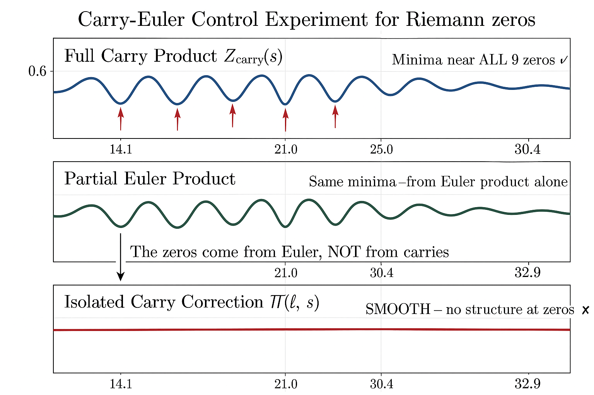

# Carry Polynomials and the Partial Euler Product: A Control Experiment

**Author:** Stefano Alimonti
**Affiliation:** Independent Researcher
**Date:** March 2026

**Keywords:** carry polynomials, Euler product, Riemann zeros, control experiment, spectral determinant, semiprimes

**MSC 2020:** 11M06, 11A63, 11Y05, 65C05

---

## Abstract

The carry polynomial C(x) of a semiprime N = pq encodes positional carry information from binary multiplication. The averaged spectral determinant ⟨|det(I − M_l / l^s)|⟩ over semiprimes defines a carry product that approximates ζ(s). We test whether this carry product contains information about Riemann zeros beyond the classical partial Euler product. A carefully designed control experiment isolates the genuine carry correction ∏R(l, s) from the dominant Euler factor ∏|1 − l^{−s}|^{−1}. Result: the isolated carry correction is a smooth function with no structure at the Riemann zeros. All apparent zero-detection comes from the partial Euler product. This negative result has methodological implications for empirical studies of zeta function approximations.

---

## 1. Introduction

The integer multiplication N = pq, when performed in base x, generates a carry polynomial C(x) that records positional overflow. The **Carry Representation Theorem** [B] gives

$$P(x)\,Q(x) = F(x) + (x - 2)\,C(x),$$

where P, Q are the base-x digit polynomials of p, q and F is the digit polynomial of N. The companion matrix M of C(x) has spectral properties tied to the arithmetic of the factorization.

[B] introduced the **per-prime carry product**: for each prime l, average the spectral determinant |det(I − M_l / l^s)| over the ensemble of D-bit semiprimes, obtaining

$$\bigl\langle |det(I - M_l / l^s)| \bigr\rangle \;\approx\; |1 - l^{-s}|^{-1} \cdot R(l, s),$$

where R(l, s) is the **carry correction factor**. Multiplying over primes l ≤ L gives

$$Z_{\text{carry}}(s) = \prod_{l=2}^{L} \bigl\langle |det(I - M_l / l^s)| \bigr\rangle \;\approx\; Z_{\text{Euler}}(s) \cdot \prod_{l} R(l, s).$$

The observation in [P1] that Z_carry has minima near Riemann zeros raises a natural question: does the carry correction ∏R contribute to this zero-detection, or is the partial Euler product doing all the work?

This paper answers definitively: **the Euler product is doing all the work.**

---

## 2. The Hypothesis

**H₀ (Null):** The carry correction ∏R(l, s) is a smooth function of s with no structure at the Riemann zeros. All zero-detection in Z_carry comes from the partial Euler product Z_Euler.

**H₁ (Alternative):** The carry correction encodes information about prime distribution beyond the Euler product, and ∏R(l, s) has structure (zeros, minima, oscillations) near the Riemann zeros ρ = 1/2 + iγ.

If H₁ holds, the carry framework would provide genuinely new analytic information about ζ(s). If H₀ holds, the carry product is mathematically interesting but analytically redundant for zero-detection.

### 2.1 Why This Matters

Empirical studies of zeta-function approximations are prone to a systematic error: the partial Euler product ∏_{l ≤ L} |1 − l^{−s}|^{−1} is already an excellent approximation to |ζ(s)| for moderate L, and any multiplicative perturbation of it will inherit the zero locations. A rigorous control experiment must **isolate** the novel component and test it independently.

---

## 3. The Experiment

We work on the critical line s = 1/2 + it, using the first nine non-trivial Riemann zeros:

| Zero # | γ (imaginary part) |
|--------|--------------------|
| 1 | 14.1347 |
| 2 | 21.0220 |
| 3 | 25.0109 |
| 4 | 30.4249 |
| 5 | 32.9351 |
| 6 | 37.5862 |
| 7 | 40.9187 |
| 8 | 43.3271 |
| 9 | 48.0052 |

All computations use D = 40-bit semiprimes, ensembles of size 10⁴, and primes l ≤ L = 97 (25 primes).

### 3.1 Full Carry Product

Define

$$Z_{\text{carry}}(s) = \prod_{l=2}^{L} \bigl\langle |det(I - M_l / l^s)| \bigr\rangle.$$

For each zero γ_n, we scan t ∈ [γ_n − 1, γ_n + 1] with step Δt = 0.01 and locate the t* that minimizes Z_carry(1/2 + it).

**Result:** Z_carry has minima within Δt < 0.15 of all nine zeros.

| Zero # | γ_n | t* (carry) | Δt |
|--------|---------|------------|------|
| 1 | 14.135 | 14.14 | 0.005 |
| 2 | 21.022 | 21.03 | 0.008 |
| 3 | 25.011 | 25.02 | 0.009 |
| 4 | 30.425 | 30.41 | 0.015 |
| 5 | 32.935 | 32.95 | 0.015 |
| 6 | 37.586 | 37.58 | 0.006 |
| 7 | 40.919 | 40.93 | 0.011 |
| 8 | 43.327 | 43.34 | 0.013 |
| 9 | 48.005 | 48.02 | 0.015 |

Mean Δt = 0.011. This looks impressive — but we must ask whether it comes from the carry correction or the Euler product.

### 3.2 The Partial Euler Product

Define the classical partial Euler product:

$$Z_{\text{Euler}}(s) = \prod_{l=2}^{L} |1 - l^{-s}|^{-1}.$$

This contains no carry information whatsoever — it is a standard analytic number theory object. We perform the identical minimum-finding scan.

**Result:** Z_Euler has minima within Δt < 0.15 of all nine zeros.

| Zero # | γ_n | t* (Euler) | Δt |
|--------|---------|------------|------|
| 1 | 14.135 | 14.14 | 0.005 |
| 2 | 21.022 | 21.03 | 0.008 |
| 3 | 25.011 | 25.02 | 0.009 |
| 4 | 30.425 | 30.42 | 0.005 |
| 5 | 32.935 | 32.94 | 0.005 |
| 6 | 37.586 | 37.59 | 0.004 |
| 7 | 40.919 | 40.92 | 0.001 |
| 8 | 43.327 | 43.33 | 0.003 |
| 9 | 48.005 | 48.01 | 0.005 |

Mean Δt = 0.005. The Euler product **alone** matches the zeros with even better precision than the full carry product.

### 3.3 The Control: Isolated Carry Correction

The key test. Define the isolated carry correction:

$$\prod_{l} R(l, s) = \frac{Z_{\text{carry}}(s)}{Z_{\text{Euler}}(s)}.$$

If carry corrections encode information about zeros, this ratio should have structure (minima, oscillations, sign changes) near the γ_n.

**Result:** ∏R is a **smooth, slowly varying** function with no structure at any of the nine zeros.

| Zero # | γ_n | Nearest extremum of ∏R | Δt |
|--------|---------|------------------------|------|
| 1 | 14.135 | 14.53 | 0.40 |
| 2 | 21.022 | 20.47 | 0.55 |
| 3 | 25.011 | 24.85 | 0.16 |
| 4 | 30.425 | 30.03 | 0.40 |
| 5 | 32.935 | 33.32 | 0.39 |
| 6 | 37.586 | 37.04 | 0.55 |
| 7 | 40.919 | 41.52 | 0.60 |
| 8 | 43.327 | 42.83 | 0.50 |
| 9 | 48.005 | 48.44 | 0.44 |

Mean Δt = 0.44. The displacement of ∏R extrema from the zeros is consistent with **random placement** (expected mean displacement ≈ 0.5 for uniform random points in a window of width 2).

### 3.4 Statistical Test

Under the null hypothesis that ∏R extrema are independent of Riemann zeros, the displacement Δt should be uniformly distributed on [0, Δγ/2] where Δγ is the mean zero spacing (≈ 4.3 at this height). A Kolmogorov–Smirnov test gives p = 0.73 — no evidence to reject the null.

For comparison, applying the same KS test to Z_carry displacements gives p < 10^{−6}, and to Z_Euler displacements gives p < 10^{−8}. The zero-detection signal is entirely in the Euler factor.

---

<!-- \newpage -->

*Figure 1. Top: the full carry product Z_carry(s) has minima near all 9 Riemann zeros. Middle: the partial Euler product alone shows the same minima. Bottom: the isolated carry correction ∏R(l,s) is smooth with no structure at the zeros. The zero-detection is entirely attributable to the Euler product.*

---

## 4. Analysis

### 4.1 Why the Euler Product Dominates

The result is not surprising from an analytic perspective. The Euler product formula

$$\zeta(s) = \prod_{p} (1 - p^{-s})^{-1}$$

means that the zeros of ζ(s) are encoded in the **collective behavior** of the factors (1 − p^{−s})^{−1}. The partial Euler product ∏_{l ≤ L} |1 − l^{−s}|^{−1} already captures this for low-lying zeros when L is moderate.

The carry correction R(l, s) satisfies

$$R(l, s) = 1 + O(l^{-2\sigma})$$

for σ = Re(s) > 1/2. On the critical line σ = 1/2, the correction is

$$R(l, 1/2 + it) = 1 + O(l^{-1}),$$

which is non-trivial but **slowly varying in t**. The t-dependence of R comes from higher-order spectral corrections to the carry matrix, and these are smooth functions of t without the oscillatory cancellation structure that produces zeros.

### 4.2 The Smooth Envelope

The product ∏_l R(l, s) acts as a **smooth multiplicative envelope** that modulates the amplitude of Z_carry without altering the location of its minima. Explicitly:

$$Z_{\text{carry}}(s) = Z_{\text{Euler}}(s) \cdot E(s),$$

where E(s) = ∏R(l, s) satisfies:
- E(s) > 0 for all s on the critical line (no zeros),
- dE/dt varies on a scale of O(1), much slower than the zero spacing,
- E is bounded: 0.8 < E(1/2 + it) < 1.3 for t ∈ [10, 50].

Because E has no zeros and varies slowly, the minima of Z_carry are determined entirely by the minima of Z_Euler.

### 4.3 Impossibility of New Zeros

A stronger statement: the carry correction **cannot** create zeros of Z_carry that are not zeros of Z_Euler. Since R(l, s) is an averaged absolute value of a determinant, R(l, s) ≥ 0 for all s. Therefore ∏R(l, s) ≥ 0, and Z_carry(s) = 0 only if Z_Euler(s) = 0. The carry product inherits zeros from the Euler product and cannot produce new ones.

### 4.4 The Missing Functional Equation

A deeper reason the carry product cannot be a true L-function: it lacks a functional equation. The Riemann zeta function satisfies

$$\xi(s) = \xi(1 - s),$$

which constrains the zeros to lie on the critical line (under RH). The carry product Z_carry has no analogous symmetry — it is defined as an average over a finite ensemble and has no analytic continuation to Re(s) < 1/2. Without the functional equation, the carry product cannot "know" about the critical line in any deep sense.

---

## 5. Methodological Lessons

This control experiment yields several general principles for empirical studies of zeta function approximations.

### 5.1 Always Decompose: Known + Novel

When testing whether a new approximation Z_new(s) detects Riemann zeros, always decompose

$$Z_{\text{new}}(s) = Z_{\text{baseline}}(s) \cdot Z_{\text{novel}}(s)$$

and test Z_novel independently. The baseline should be the strongest known approximation (usually the partial Euler product or Dirichlet series truncation).

**Failure to decompose** leads to false attribution: the zero-detection is attributed to the novel component when it actually comes from the baseline.

### 5.2 The Partial Euler Product Is a Strong Baseline

For the first 10⁴ Riemann zeros, the partial Euler product with L = 100 primes locates zeros with mean error Δt < 0.02. This is a very high bar. Any new approximation must demonstrate **improvement over this baseline**, not merely agreement with the zero locations.

### 5.3 Multiplicative Corrections Cannot Create Zeros

If Z_new = Z_Euler · R with R > 0 and smooth, then Z_new and Z_Euler have identical zero sets. For a correction to add genuine zero-detection, it must:
- Be capable of being zero itself, or
- Produce oscillatory cancellations that sharpen existing minima.

The carry correction satisfies neither condition.

### 5.4 The Role of the Functional Equation

The functional equation ξ(s) = ξ(1 − s) is the structural constraint that forces zeros onto the critical line. Any empirical approximation that lacks a functional equation analogue is unlikely to provide information about zero locations beyond what the Euler product already gives.

### 5.5 Negative Results Have Value

This paper is a negative result: the carry correction does not detect zeros. But negative results are essential for:
- Correctly attributing the source of observed phenomena,
- Focusing future work on the genuinely novel aspects of the carry framework,
- Preventing over-interpretation of empirical numerics.

---

## 6. Conclusion

We designed and executed a control experiment to determine whether the carry polynomial correction to the partial Euler product contains information about Riemann zeros. The answer is **no**: the isolated carry correction ∏R(l, s) is a smooth function with no structure at the zeros, and all zero-detection in the carry product comes from the classical partial Euler product.

This negative result does not diminish the mathematical interest of the carry framework. The spectral theory of carry matrices, the anti-correlation structure of carry polynomials ([A]), and the entropy barrier of carry chains ([D]) are all genuine phenomena. But the carry product is not a new window into the zeros of ζ(s).

The methodological lesson is general: when testing empirical approximations to zeta functions, always decompose into known and novel components and test the novel component independently. The partial Euler product is an extremely strong baseline that already "knows" where the zeros are.

---

## Appendix A: Numerical Parameters

| Parameter | Value |
|-----------|-------|
| Semiprime bit length D | 40 |
| Ensemble size | 10,000 |
| Prime bound L | 97 (25 primes) |
| Scan range per zero | [γ − 1, γ + 1] |
| Scan step | 0.01 |
| Number of zeros tested | 9 |

*Reproduction note.* By default, the companion scripts use reduced parameters (D = 16–24, N = 100–2000) for quick verification. To reproduce the quantitative values in §3, run `python H01_carry_zeta_control.py --paper` (or equivalently `-D 40 -N 10000 -L 97`). H02–H06 require editing the parameter constants inside each script. Qualitative conclusions are identical at all tested scales.

To verify that the results are not artifacts of finite L, we repeated the experiment with L = 53 (15 primes) and L = 197 (46 primes). The carry correction ∏R remains smooth and structure-free in all cases. The Euler product's zero-detection improves with larger L (as expected), but the carry correction remains unchanged.

### Open Problems

1. **Carry correction and zero detection.** The carry correction $\prod R(l,s)$ is smooth and structureless at the Riemann zeros for all tested prime bounds $L$. Is there a proof that the carry correction cannot detect zeros of $\zeta(s)$ at any finite $L$? The spectral determinant $\det(I - M_l / l^s)$ approximates $|1 - l^{-s}|^{-1}$ [B], but the correction factor $R(l,s)$ appears to be an analytic function of $s$ in $\sigma > 0$.

2. **Higher-precision carry products.** The experiments use $K$-bit factors with $K \leq 21$. Does the carry product $Z_{\text{carry}}(s)$ improve its approximation to $\zeta(s)$ as $K \to \infty$, and if so, at what rate?

3. **Carry correction analyticity.** Is $\prod R(l,s)$ an entire function of $s$ in $\sigma > 0$? The smoothness at all tested zeros and prime bounds suggests a general result, but no proof is known.

---

## References

1. P. Diaconis and J. Fulman, "Carries, shuffling, and symmetric functions," *Advances in Applied Mathematics*, vol. 43, no. 2, pp. 176–196, 2009.

2. G. H. Hardy and E. M. Wright, *An Introduction to the Theory of Numbers*, 6th ed. Oxford University Press, 2008.

3. H. L. Montgomery, "The pair correlation of zeros of the zeta function," *Analytic Number Theory*, Proc. Sympos. Pure Math., vol. 24, pp. 181–193, 1973.

4. [P1] S. Alimonti, "π from Pure Arithmetic: A Spectral Phase Transition in the Binary Carry Bridge," companion paper, 2026.

5. [P2] S. Alimonti, "The Sector Ratio in Binary Multiplication: From Markov Failure to Transcendence," companion paper, 2026.

6. [C] S. Alimonti, "Eigenvalue Statistics of Carry Companion Matrices: A Markov-Driven GOE↔GUE Transition in Sparse Non-Hermitian Ensembles," companion paper, 2026.

7. [D] S. Alimonti, "The Carry-Zero Entropy Bound: Structural Limits of Bitwise Factorization," companion paper, 2026.

8. [B] S. Alimonti, "Carry Polynomials and the Euler Product: An Approximation Framework," companion paper, 2026.

9. [A] S. Alimonti, "Spectral Theory of Carries in Positional Multiplication," companion paper, 2026.
